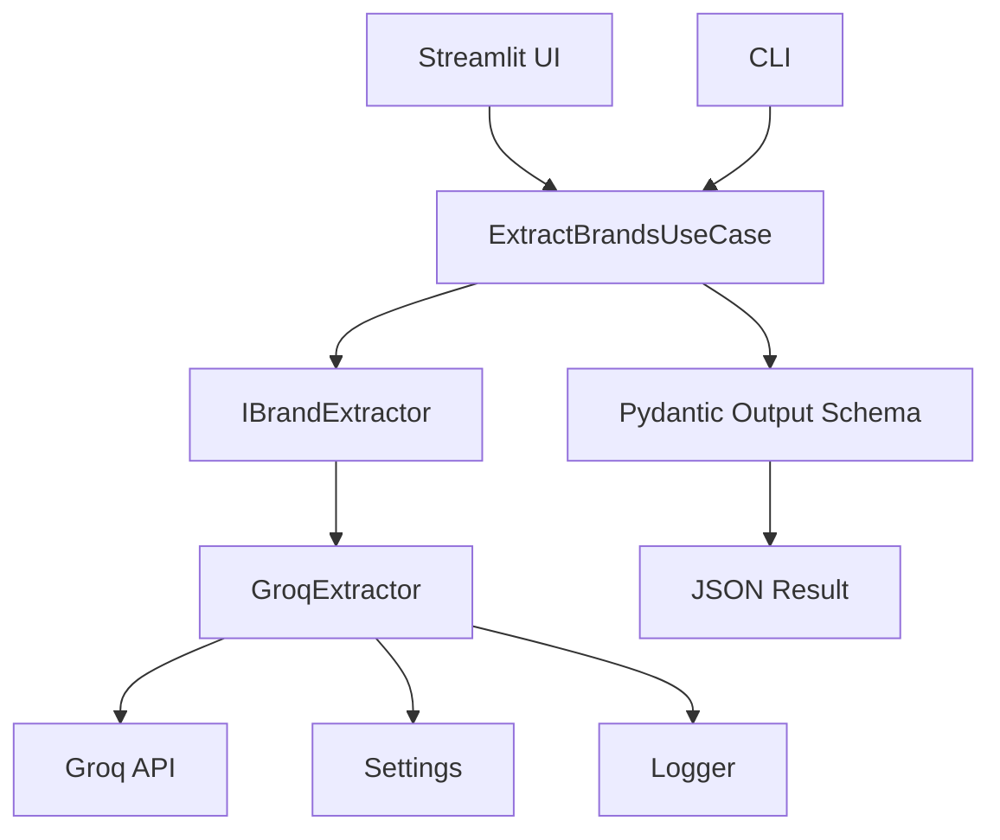

# Architecture Diagram



## Camadas

### Presentation

* Streamlit UI
* CLI

### Application

* ExtractBrandsUseCase

### Domain

* Interfaces
* Schemas
* Entities

### Infrastructure

* GroqBrandExtractor
* Settings

### Shared

* Logger
* Exceptions

```
```
