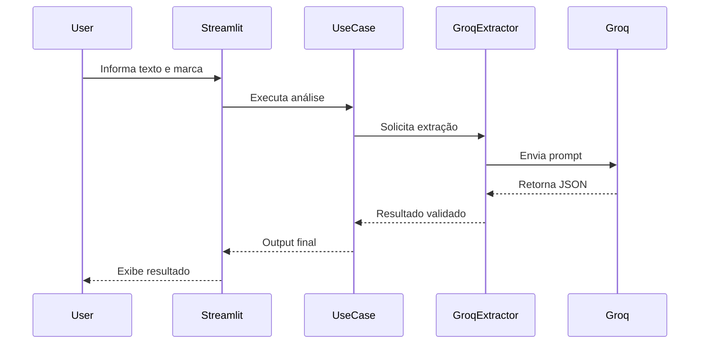

# Execution Flow



## Fluxo

1. Usuário informa texto.
2. Usuário informa marca monitorada.
3. Streamlit envia dados para o Use Case.
4. O Use Case chama a interface de extração.
5. A implementação Groq realiza a chamada para a LLM.
6. O retorno é validado com Pydantic.
7. O resultado é devolvido para a interface.
8. O usuário visualiza o JSON final.

```
```
